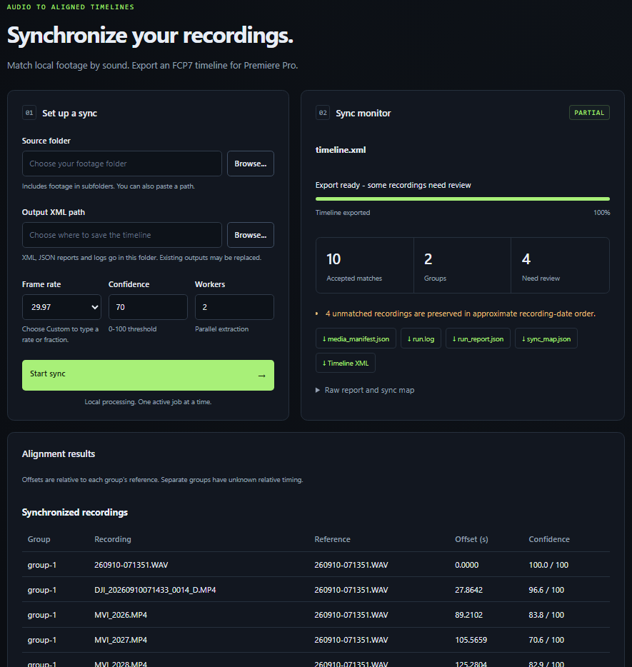
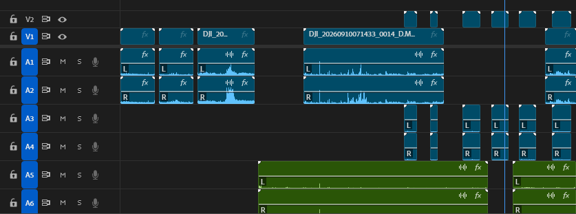

# Acoustic Sync

Программа синхронизирует видео с разных камер и отдельные аудиозаписи по звуку. Результат — файл `timeline.xml` для импорта в Adobe Premiere Pro. Исходные файлы остаются на месте.



## 1. Установка — один раз

Распакуйте программу в отдельную папку. Для установки нужен интернет.

**Windows**

1. Откройте папку программы.
2. Дважды нажмите **install.bat**.
3. Дождитесь окончания установки. Если система запросит разрешение на установку компонентов, подтвердите его.

Установщик подготовит Python, FFmpeg и необходимые библиотеки. Для автоматической установки отсутствующих системных компонентов нужен `winget` — диспетчер пакетов Windows. Если появится ошибка, смотрите [подробную инструкцию](docs/installation.md).

**macOS и Linux**

Откройте терминал в папке программы и выполните:

```bash
bash install.sh
```

На macOS предварительно должен быть установлен Homebrew. Автоматическая установка на Linux поддерживает системы с `apt`, в репозиториях которых доступен Python 3.12 или новее, например Ubuntu 24.04. Установщик может запросить пароль администратора; при вводе в терминале символы не отображаются.

## 2. Запуск

- **Windows:** дважды нажмите **run-web.bat**.
- **macOS / Linux:** в терминале из папки программы выполните `bash run-web.sh`.

Браузер откроется автоматически. Если этого не произошло, откройте [http://127.0.0.1:8765](http://127.0.0.1:8765).

**Не закрывайте окно запуска во время работы.** Для остановки программы нажмите в нём `Ctrl+C`. Повторно устанавливать программу перед каждым запуском не нужно.

## 3. Как синхронизировать записи

1. Сложите исходники в общую папку. Для каждой камеры и аудиорекордера удобно создать свою подпапку: она получит собственные дорожки на таймлайне.
2. В интерфейсе нажмите **Browse** возле **Source folder** и выберите общую папку.
3. **Output XML path** заполнится автоматически: `timeline.xml` внутри выбранной папки. При необходимости выберите другое место или имя. При повторном запуске существующие результаты по этому пути могут быть заменены.
4. В **Frame rate** выберите частоту кадров будущего таймлайна. Для точного значения выберите **Custom**. **Confidence** и **Workers** для начала можно оставить равными **70** и **2**.
5. Нажмите **Start sync** и дождитесь завершения.
6. В Premiere откройте свой проект и импортируйте полученный `timeline.xml` через **File → Import**.

Пути и настройки сохраняются в этом браузере. Все записи обрабатываются локально на компьютере.

Если результат помечен **PARTIAL**, таймлайн создан, но некоторые клипы требуют проверки. Клипы без найденной синхронизации сохраняются с исходными именами и отмечаются маркерами `NOT_SYNCED`. Проверьте синхронизацию перед монтажом.

[Установка и решение проблем](docs/installation.md) · [Подробное использование](docs/usage.md) · [Документация для разработчиков](docs/development.md)

Полученный файл timeline.xml нужно импортировать в монтажную программу. Все клипы будут разобраны по порядку и синхронизированы.

